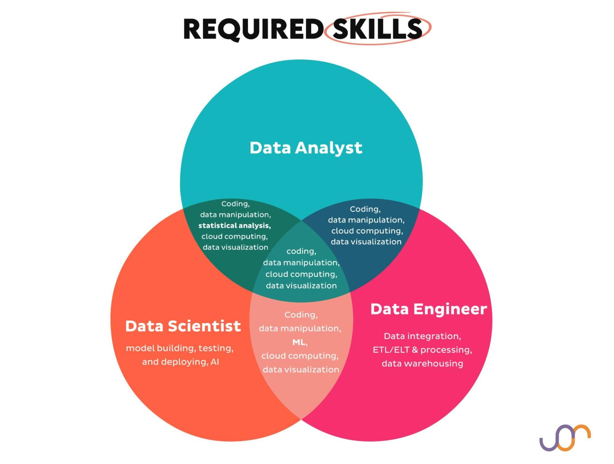
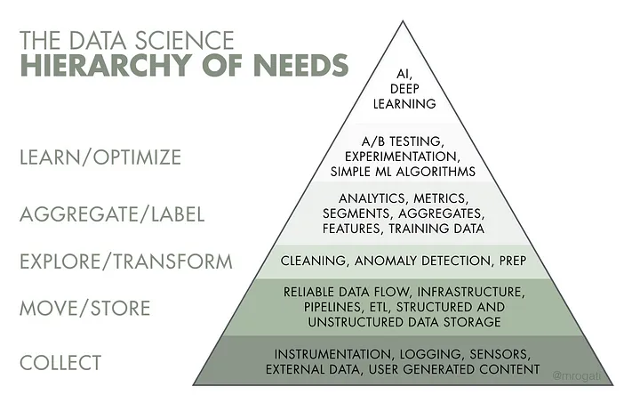
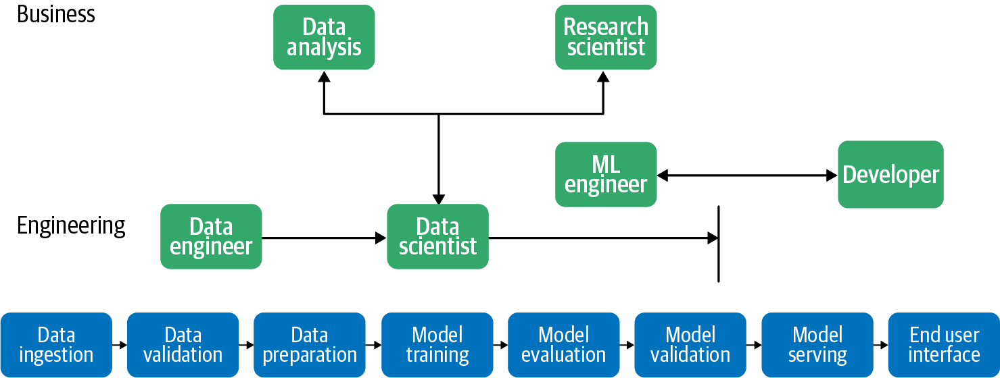

# Carreras de Data

El campo de los datos ofrece muchas oportunidades y en constante expansión. Lo que hace especialmente interesante este sector es su naturaleza interdisciplinar, donde convergen tres grandes áreas: matemáticas, programación y conocimiento del negocio. La combinación única de estas habilidades determina el perfil profesional específico y las trayectorias disponibles. Esta guía te ayudará a navegar el ecosistema de carreras en datos, desarrollar un perfil competitivo y destacar en el mercado laboral.

## El Triángulo de Competencias en Datos

Todos los profesionales de datos operan dentro de un "triángulo de competencias" formado por tres pilares fundamentales:

- **Matemáticas y Estadística**: Desde estadística descriptiva básica hasta algoritmos complejos de machine learning.
- **Programación y Herramientas Técnicas**: Lenguajes, frameworks y plataformas para manipular datos.
- **Conocimiento del Negocio**: Comprensión del dominio específico y traducción de problemas de negocio a soluciones basadas en datos.

La proporción de estas habilidades varía según el rol, creando perfiles distintos pero complementarios:

## Los Tres Pilares de Carreras en Datos

### 1. Analista de Datos

El analista de datos se sitúa en la intersección entre el conocimiento del negocio y un nivel intermedio de matemáticas/programación. Su fortaleza radica en traducir datos en insights accionables para los equipos de negocio.

### Perfil y Responsabilidades

- Recopila, procesa e interpreta conjuntos de datos para optimizar decisiones empresariales
- Crea dashboards, informes y visualizaciones para comunicar hallazgos
- Realiza análisis exploratorios para identificar patrones y tendencias
- Diseña y monitorea KPIs para evaluar el rendimiento del negocio
- Colabora con diferentes departamentos para resolver problemas específicos mediante datos

### Próximos Pasos para profundizar:

1. **Profundizar en SQL avanzado**:
    - Dominar window functions, CTEs y subconsultas complejas
    - Optimización de consultas para grandes volúmenes de datos
    - Aprender SQL específico para Data Warehousing (Redshift, Snowflake, BigQuery)
2. **Ampliar herramientas de BI**:
    - Incorporar Tableau o Power BI a tu conjunto de habilidades (elige uno y especialízate)
    - Aprender modelado dimensional para data warehousing
3. **Estadística aplicada**:
    - Profundizar en pruebas de hipótesis y significancia estadística
    - Dominar análisis multivariante
    - Aprender diseño experimental y A/B testing
4. **Automatización de análisis**:
    - Crear pipelines de reporting automatizados
    - Aprender Airflow básico para orquestación de tareas analíticas
    - Implementar alertas basadas en anomalías estadísticas
5. **Especialización por industria**:
    - Desarrollar conocimiento profundo en métricas específicas de un sector (retail, finanzas, salud)
    - Aprender metodologías analíticas específicas para tu dominio de interés

### Proyecto de Portfolio Recomendado

Desarrolla un dashboard interactivo en Plotly Dash o Shiny que analice datos públicos de un sector específico, incluyendo:

- Visualizaciones interactivas que permitan filtrado dinámico
- Análisis de tendencias temporales y estacionalidad
- Segmentación de datos con insights accionables
- Métricas clave y KPIs con análisis comparativo

### 2. Ingeniero de Datos

El ingeniero de datos se posiciona en la intersección entre programación avanzada y una comprensión media de los requerimientos del negocio. Su valor principal está en construir y mantener la infraestructura que permite el flujo eficiente de datos.

### Perfil y Responsabilidades

- Diseña, construye y optimiza sistemas de almacenamiento y procesamiento de datos
- Desarrolla pipelines de ETL/ELT para integrar datos de múltiples fuentes
- Implementa soluciones para garantizar la calidad, seguridad y disponibilidad de los datos
- Crea y mantiene infraestructura para procesar grandes volúmenes de información
- Proporciona herramientas y acceso a datos a analistas y científicos de datos

### Próximos Pasos para profundizar:

1. **Ampliar conocimientos en bases de datos**:
    - Profundizar en administración y optimización de PostgreSQL
    - Explorar bases de datos distribuidas (Cassandra, HBase)
    - Aprender soluciones de data warehousing cloud (Snowflake, BigQuery, Redshift)
2. **Desarrollar habilidades en procesamiento de datos a escala**:
    - Aprender Apache Spark para procesamiento distribuido
    - Familiarizarte con Apache Kafka para datos en streaming
    - Explorar soluciones serverless en plataformas cloud (AWS Lambda, Azure Functions)
3. **Dominar infraestructura como código**:
    - Aprender Docker y Kubernetes para contenedores
    - Familiarizarte con Terraform o CloudFormation para aprovisionamiento de infraestructura
    - Desarrollar habilidades en CI/CD para automatizar despliegues
4. **Orquestación de flujos de datos**:
    - Dominar Apache Airflow o similar para orquestación
    - Implementar monitoreo y alertas para pipelines de datos
    - Aprender sobre patrones de diseño para arquitecturas de datos modernas
5. **Herramientas de transformación moderna**:
    - Aprender dbt (data build tool) para transformaciones analíticas
    - Explorar soluciones de ELT frente a ETL tradicional
    - Familiarizarte con data lakehouse (Delta Lake, Iceberg)

### Proyecto de Portfolio Recomendado

Desarrolla un pipeline de datos end-to-end que:

- Extraiga datos de diversas fuentes (APIs públicas, bases de datos, archivos)
- Implemente procesamiento en batch y/o tiempo real
- Utilice Docker para contenerizar componentes
- Incluya transformaciones con herramientas modernas
- Proporcione una capa para consumo analítico
- Demuestre buenas prácticas de testing, documentación y monitoreo

### 3. Científico de Datos

El científico de datos se ubica en la intersección entre matemáticas avanzadas y conocimientos básicos de programación, con suficiente conocimiento del negocio para aplicar sus modelos a problemas reales. Su valor principal está en extraer patrones predictivos y prescriptivos de los datos.

### Perfil y Responsabilidades

- Desarrolla modelos predictivos y algoritmos de machine learning
- Diseña e implementa experimentos estadísticos para validar hipótesis
- Extrae insights a partir de datos complejos y no estructurados
- Traduce problemas de negocio en frameworks matemáticos
- Comunica resultados técnicos a audiencias no técnicas

### Próximos Pasos para profundizar:

1. **Profundizar en matemáticas y estadística**:
    - Estudiar álgebra lineal y cálculo multivariable aplicados a ML
    - Dominar estadística inferencial y bayesiana
    - Aprender teoría de la probabilidad avanzada
2. **Ampliar conocimientos en machine learning**:
    - Dominar scikit-learn para algoritmos tradicionales
    - Aprender frameworks de deep learning (TensorFlow/Keras o PyTorch)
3. **Desarrollar habilidades en MLOps**:
    - Familiarizarte con plataformas de experimentación (MLflow, Weights & Biases)
    - Aprender despliegue de modelos (TensorFlow Serving, Flask/FastAPI)
4. **Ampliar métodos de análisis avanzado**:
    - Aprender técnicas de optimización y búsqueda de hiperparámetros
    - Dominar técnicas de series temporales avanzadas
    - Explorar métodos de aprendizaje por refuerzo
5. **Especialización en campos específicos**:
    - Profundizar en un área específica como NLP, visión por computadora, o recomendación
    - Estudiar técnicas específicas para tu industria de interés
    - Mantenerte al día con investigaciones recientes mediante papers académicos

### Proyecto de Portfolio Recomendado

Desarrolla un proyecto end-to-end que:

- Aborde un problema real con datos públicos interesantes
- Incluya análisis exploratorio detallado con visualizaciones interpretables
- Implemente múltiples algoritmos con comparación rigurosa
- Contenga validación cruzada y optimización de hiperparámetros
- Proporcione una interfaz simple (API o aplicación) para usar el modelo
- Incluya documentación detallada del enfoque metodológico y decisiones tomadas

## Construyendo un Curriculum Efectivo

Un curriculum bien estructurado es tu primera oportunidad para destacar en un mercado competitivo. Para profesionales de datos, es crucial balancear aspectos técnicos con habilidades blandas y logros cuantificables.

### Estructura Recomendada

1. **Encabezado y Contacto**:
    - Nombre, información de contacto profesional
    - Enlaces a GitHub, LinkedIn, y portfolio personal
    - Ubicación (ciudad/país) y disponibilidad para relocalización si aplica
2. **Resumen Profesional**:
    - Párrafo conciso (3-5 líneas) destacando tu especialización y experiencia
    - Menciona tecnologías clave relevantes para el puesto
    - Incluye 1-2 logros significativos cuantificados
3. **Habilidades Técnicas**:
    - Organiza por categorías: Lenguajes, Frameworks, Bases de datos, Cloud, Herramientas
    - Incluye nivel de competencia si te beneficia (evita términos como "básico")
    - Prioriza habilidades relevantes para el puesto específico
4. **Experiencia Profesional**:
    - Organización inversa cronológica
    - Para cada posición: empresa, puesto, fechas, ubicación
    - 3-5 bullets por rol enfocados en logros, no responsabilidades
    - Utiliza el formato: Acción + Detalle + Resultado cuantificable
5. **Proyectos Relevantes**:
    - Especialmente importante si tienes poca experiencia laboral
    - Incluye 2-4 proyectos con título, tecnologías usadas y resultados
    - Añade links a repositorios de GitHub o demos en vivo
6. **Educación y Certificaciones**:
    - Títulos académicos, instituciones y fechas
    - Certificaciones relevantes (AWS, Azure, Google Cloud, estadística, ML)
    - Cursos especializados que complementen tu perfil

### Tips Específicos para Profesionales de Datos

1. **Cuantifica tus logros**: "Implementé un modelo de predicción que redujo el churn en un 15%" es mejor que "Desarrollé modelos predictivos".
2. **Usa palabras clave específicas**: Incluye términos técnicos relevantes para superar filtros de ATS, pero solo aquellos que realmente domines.
3. **Personaliza para cada puesto**: Adapta la sección de habilidades y el resumen para alinearte con los requisitos específicos de cada vacante.
4. **Muestra impacto de negocio**: Conecta tus habilidades técnicas con resultados tangibles para la empresa (aumento de ingresos, reducción de costos, mejora de procesos).
5. **Equilibra lo técnico con lo comunicativo**: Destaca también habilidades de presentación, colaboración y comunicación de resultados.

Plantilla disponible en: https://www.piratekingdom.com/blog/my-faang-resume

## Desarrollando un Portfolio Impactante

Con los conocimientos que ya tienes en Python, Pandas, visualización y bases de datos, puedes construir un portfolio que demuestre tus habilidades de manera efectiva.

### Plataformas Recomendadas

1. **GitHub**: Indispensable para mostrar código y proyectos técnicos.
2. **Sitio web personal**: Complementa GitHub con explicaciones más detalladas y visuales.
3. **Medium/Towards Data Science**: Publica análisis detallados de tus proyectos.
4. **Kaggle**: Participa en competiciones o publica notebooks instructivos.
5. **LinkedIn**: Comparte regularmente posts sobre tus proyectos y aprendizajes.

### Elementos Clave del Portfolio

### Para Analistas de Datos:

1. **Dashboard interactivo**:
    - Utiliza tus conocimientos de Plotly o Shiny para crear visualizaciones interactivas
    - Enfócate en contar una historia con los datos y proporcionar insights accionables
    - Incluye filtros y profundidad variable para diferentes usuarios
2. **Proyecto de análisis exploratorio completo**:
    - Selecciona un dataset público interesante pero no sobreutilizado
    - Muestra tu proceso de pensamiento, incluyendo callejones sin salida
    - Utiliza visualizaciones efectivas con Seaborn/Plotly para comunicar hallazgos
    - Concluye con recomendaciones claras basadas en los datos
3. **Análisis de series temporales**:
    - Demuestra tu capacidad para identificar patrones estacionales y tendencias
    - Implementa forecast básico con métodos estadísticos
    - Visualiza resultados de manera clara y explica las implicaciones
4. **Proyecto con SQL y Python integrados**:
    - Muestra tu capacidad para extraer datos con SQL complejo
    - Transforma y analiza con pandas
    - Documenta todo el flujo con comentarios claros

### Para Ingenieros de Datos:

1. **Pipeline ETL/ELT completo**:
    - Utiliza tus conocimientos de Python, PostgreSQL y MongoDB
    - Implementa extracción de APIs o web scraping
    - Muestra transformaciones con pandas
    - Carga en bases de datos relacionales y NoSQL
    - Documenta decisiones de diseño y optimizaciones
2. **Proyecto de integración de bases de datos**:
    - Demuestra cómo conectar PostgreSQL y MongoDB
    - Implementa sincronización o migración de datos
    - Destaca consideraciones de rendimiento
3. **Proyecto de API de datos**:
    - Crea una API REST con FastAPI o Flask
    - Conecta con bases de datos para proporcionar datos en tiempo real
    - Documenta con Swagger y proporciona ejemplos de uso
4. **Solución de almacenamiento optimizada**:
    - Implementa un esquema optimizado para consultas analíticas
    - Demuestra indexación y particionado para mejor rendimiento
    - Incluye scripts de administración y mantenimiento

### Para Científicos de Datos:

1. **Proyecto de clasificación end-to-end**:
    - Explora diferentes algoritmos (no solo modelos black-box)
    - Implementa feature engineering detallado
    - Realiza selección rigurosa de modelos con validación cruzada
    - Explica los trade-offs entre métricas (precisión vs. recall)
2. **Proyecto de NLP básico**:
    - Implementa análisis de sentimiento o clasificación de texto
    - Utiliza técnicas modernas (embeddings, transformers básicos)
    - Visualiza resultados de manera informativa
3. **Proyecto con datos no estructurados**:
    - Trabaja con imágenes, audio o datos temporales
    - Demuestra preprocesamiento específico para estos tipos de datos
    - Implementa modelos adecuados para el tipo de datos
4. **Análisis exploratorio avanzado**:
    - Realiza análisis multivariante completo
    - Implementa reducción de dimensionalidad (PCA, t-SNE)
    - Utiliza visualizaciones avanzadas para datos complejos

### Consejos para un Portfolio Efectivo

1. **Calidad sobre cantidad**: Es mejor tener 2-3 proyectos excelentes que 10 mediocres.
2. **Documentación impecable**: Cada proyecto debe incluir:
    - README detallado explicando problema, enfoque y resultados
    - Comentarios claros en el código
    - Requisitos y instrucciones de instalación/ejecución
3. **Cuenta historias con datos**: No solo muestres técnicas, explica por qué las utilizas y qué valor aportan.
4. **Demuestra pensamiento crítico**: Incluye secciones sobre limitaciones, posibles mejoras y lecciones aprendidas.
5. **Actualiza regularmente**: Haz commits frecuentes y mejora tus proyectos antiguos a medida que adquieres nuevas habilidades.
6. **Comparte tu proceso**: Registra tu progreso con notebooks detallados o posts en Medium/LinkedIn.

## Estrategias para Destacar en LinkedIn

LinkedIn se ha convertido en una herramienta esencial para el networking y la búsqueda de empleo en el sector de datos. Aprovecha al máximo esta plataforma con estas estrategias específicas:

### Perfil Optimizado

1. **Título estratégico**: Incluye tu especialización y palabras clave relevantes.
    - Analista de Datos: "Analista de Datos | Especialista en Python & SQL | Visualización Avanzada con Plotly"
    - Ingeniero de Datos: "Ingeniero de Datos | Python | PostgreSQL & MongoDB | Pipelines ETL"
    - Científico de Datos: "Científico de Datos | Machine Learning | Python | Análisis Estadístico"
2. **Foto profesional y banner personalizado**: Proyecta una imagen profesional y utiliza un banner relacionado con datos o tecnología.
3. **Acerca de impactante**: Resume tu especialización, experiencia y valores profesionales en 3-5 párrafos concisos.
4. **Experiencia detallada**: Para cada posición, incluye:
    - 3-5 logros cuantificables
    - Tecnologías y metodologías utilizadas
    - Impacto en el negocio
5. **Sección de habilidades completa**: Incluye todas tus habilidades técnicas (Python, SQL, Pandas, MongoDB, etc.) y solicita validaciones a colegas.
6. **Sección de proyectos activa**: Vincula tus proyectos de GitHub directamente en LinkedIn.

### Creación de Contenido Estratégico

1. **Comparte regularmente (2-3 veces por semana)**:
    - Fragmentos de código útiles en Python
    - Visualizaciones interesantes que hayas creado
    - Tutoriales breves sobre funcionalidades específicas
    - Resúmenes de artículos o libros técnicos que hayas leído
2. **Formatos efectivos**:
    - Carruseles con consejos técnicos paso a paso
    - Posts con código y resultados visuales
    - Documentos PDF con análisis más detallados
    - Polls para generar engagement sobre temas técnicos
3. **Temáticas recomendadas**:
    - Comparativas de herramientas (ej. pandas vs dplyr)
    - Tutoriales paso a paso de funcionalidades específicas
    - Análisis de tendencias en el sector de datos
    - Soluciones a problemas comunes en análisis/ingeniería de datos
4. **Hashtags estratégicos**: Utiliza hashtags relevantes como #DataScience, #DataAnalytics, #Python, #MachineLearning para aumentar tu visibilidad.

### Networking Efectivo

1. **Conexiones estratégicas**:
    - Conéctate con profesionales en roles similares o aspiracionales
    - Sigue a líderes de opinión en el campo de datos
    - Únete a grupos específicos de Python, SQL, análisis de datos, etc.
2. **Interacción regular**:
    - Comenta en posts de influencers con aportes de valor
    - Responde preguntas en grupos relacionados con tus habilidades
    - Participa en discusiones técnicas mostrando tus conocimientos
3. **Mensajes personalizados**: Al conectar con alguien, incluye un mensaje personalizado mencionando intereses comunes o por qué quieres conectar.
4. **Solicita recomendaciones**: Pide a colegas o supervisores que destaquen habilidades específicas relacionadas con datos.

## Consejos Prácticos para tu Trayectoria Profesional

### Establecer un Plan de Aprendizaje Estructurado

Tal como sugieres, es fundamental establecer un compromiso de estudio regular:

1. **Estructura tu tiempo**: Dedica 10-15 horas semanales distribuidas estratégicamente.
2. **Lleva un registro detallado**: Crea una hoja de cálculo donde registres:
    - Fecha y duración de cada sesión de estudio
    - Tema específico estudiado
    - Recursos utilizados
    - Notas sobre lo aprendido y dudas pendientes
3. **Balanceo de habilidades**: Distribuye tu tiempo entre:
    - 40% técnicas fundamentales (Python, SQL avanzado)
    - 30% nuevas habilidades específicas para tu trayectoria
    - 20% proyectos prácticos
    - 10% soft skills y conocimiento de la industria

### Desarrollo Continuo con GitHub

Utiliza GitHub no solo como repositorio sino como herramienta de aprendizaje:

1. **Crea un repositorio de aprendizaje**: Documenta tu progreso con:
    - Notebooks para cada concepto o técnica que aprendas
    - Implementaciones propias de algoritmos o funcionalidades
    - Resúmenes de conceptos importantes
2. **Contribuye a proyectos open source**: Comienza con contribuciones pequeñas:
    - Mejora de documentación
    - Resolución de issues sencillos
    - Adición de tests

### Proyecto Integrador Significativo

Desarrolla gradualmente un proyecto sustancial que:

1. **Integre múltiples tecnologías**: Combina Python, SQL, NoSQL, visualización
2. **Aborde un problema real**: Idealmente en un sector que te interese profesionalmente
3. **Demuestre todo el ciclo analítico**: Desde la obtención de datos hasta insights accionables
4. **Evolucione con el tiempo**: Comienza simple y ve añadiendo capas de complejidad

### Enfoque Práctico de Desarrollo Profesional

1. **Especialización gradual**: Comienza con fundamentos sólidos y especialízate progresivamente en un nicho específico.
2. **Balance técnico-negocio**: Complementa tus habilidades técnicas con conocimiento del dominio de negocio.
3. **Comunidad y networking**: Participa en meetups, conferencias y grupos online relacionados con datos.
4. **Mentoría bidireccional**: Busca mentores más experimentados y también ayuda a quienes están comenzando.

## Conclusión: El Camino Por Delante

El campo de los datos sigue evolucionando rápidamente, pero los fundamentos sólidos nunca pierden relevancia. Aprovecha tus conocimientos actuales en Python, Pandas, NumPy, PostgreSQL y MongoDB como base firme sobre la cual construir tu especialización.

Recuerda que el desarrollo profesional en datos es un maratón, no un sprint. La consistencia en el aprendizaje, la construcción de un portfolio relevante, y la participación activa en la comunidad son factores clave para destacar.

Como consejo final, enfócate en resolver problemas reales con tus habilidades, no solo en acumular conocimientos teóricos. Los mejores profesionales de datos son aquellos que pueden traducir conceptos técnicos complejos en soluciones prácticas que generen valor tangible para las organizaciones.

El camino que elijas —ya sea análisis, ingeniería o ciencia de datos— ofrece oportunidades fascinantes para crecer profesionalmente, enfrentar desafíos estimulantes y generar un impacto significativo a través de los datos.